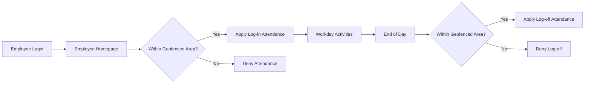
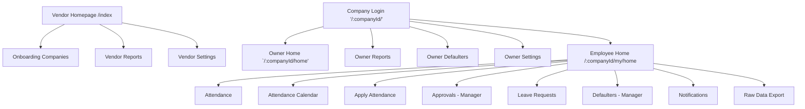
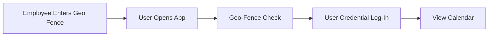
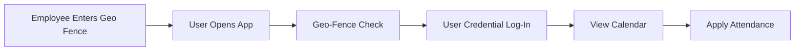
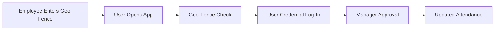
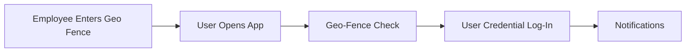
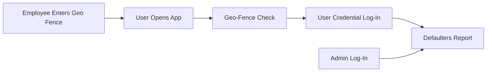
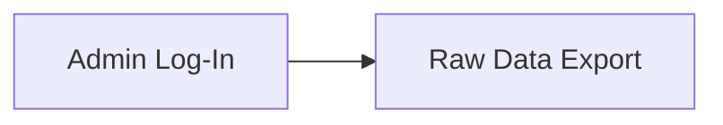

# 📘 Project : Geofence Attendance PWA + Android TWA


---


## 🚀 Project Summary
- **Name:** Geofence Attendance PWA  
- **Type:** Angular Progressive Web App (PWA) + Android Trusted Web Activity (TWA)  
- **Purpose:** Attendance tracking, company announcements, leave approvals  
- **Backend:** NestJS (multi-tenant, company-specific logic)  
- **Mobile Integration:** Android TWA wrapper for Play Store distribution (via PWABuilder Online)  
- **Notifications:** Firebase Cloud Messaging (push) + ngx-toastr (local UI)  
- **Hosting:** Requires free hosting for both frontend and backend (e.g., Vercel, Netlify, Render, Railway)
- **Multi‑tenant routing:** All company‑specific routes include a dynamic `companyId` parameter.  
- **Vendor onboarding:** Generates the `companyId` namespace used in URLs (e.g., `/companyA/`, `/companyB/`).  


---


## 🧩 Geofenced Attendance Flow


### 🔑 Flow Explanation
- **Login:** Employee enters credentials at their company’s login page (`/:companyId/` → `/:companyId/my/home`).  
- **Homepage:** Displays general vicinity (later enhanced with a map‑like background component).  
- **Geofence Check:** System verifies if employee is inside the company’s approved geofenced area.  
  - ✅ If inside → Attendance is applied (log‑in time at start of day, log‑off time at end of day).  
  - ❌ If outside → Attendance action is denied.  
- **End of Day:** Employee revisits app, geofence check runs again, log‑off attendance applied if valid.  


---


## 🌐 Website Structure

### 🧩 Flow Details

#### 📅 Attendance Calendar View (Self & Managers)

 * Calendar shows daily markers: Present, Absent, Applied, Weekly Off.
 * Dashboard summary card at the top: e.g., “16 Present, 4 Absent, 2 Applied, 2 Weekly Off.”
 * For Managers: overlay shows reportee leave indicators.
 * Monthly totals displayed with color-coded highlights.
 * Built with Angular Material Datepicker + NgRx store integration.

#### 📝 Apply Attendance Workflow

 * Employees can submit attendance requests for missed days.
 * Fields: Date, Reason (Medical, Personal, Family Function), Comments, Document upload.
 * API: POST /attendance/apply.
 * Integrated into calendar view with Apply button.

#### 🧮 Attendance Approval Metrics (Managers Only)

 * Dashboard shows Pending, Approved, Rejected, Cancelled counts.
 * Pie chart visualization alongside numeric counters.
 * Approve/Reject actions per request with instant refresh.
 * UI: card layout with counters at top, chart below.

#### 🔔 Notifications

 * Types: Approved ✅, Pending ⏳, Rejected ❌.
 * Delivered via Firebase Cloud Messaging.
 * Notification center UI: list view with grouped messages, read/unread states.
 * “Mark all as read” button at top.
 * Local UI via ngx-toastr.

#### ⏰ Defaulters Report (Managers & Admins)

 * Detects late check-ins, early exits, extended breaks.
 * Shows deviation in minutes (+45m, -35m).
 * Color-coded table view:
   * Red → late check-in / early exit
   * Green → compliant timings
 * Admin view includes filters by department/employee.

#### 📊 Raw Data Export (Admins Only)

 * Admin can export attendance logs in Excel/CSV.
 * Filters: Date range selector (calendar picker), Employee ID dropdown.
 * Columns: Emp ID, Name, Date, In Time, Out Time, Status, Source.
 * UI controls: Export button with format dropdown (Excel/CSV).


---


## 🏗️ Project structure

### 📂 `src` Folder
```plaintext
src/
├── app/
│   ├── app.config.ts
│   ├── app.html
│   ├── app.routes.ts
│   ├── app.scss
│   ├── app.spec.ts
│   ├── app.ts
├── index.html
├── main.ts
├── styles.scss
├── assets/
│   └── (empty for now)
├── environments/
│   ├── environment.ts
│   └── environment.prod.ts
```

### 📦 Dependencies (Key Libraries)
 * Angular 20.3.x core + CLI
 * Angular Material + CDK
 * Angular Service Worker + PWA
 * NgRx Store + Effects
 * Firebase + AngularFire
 * ngx-toastr
 * geolib (geofencing logic)
 * face-api.js + TensorFlow.js (biometric verification)
 * chart.js + ngx-charts (visualizations)
 * ag-grid (data tables)
 * localforage + idb (offline storage)
 * @ngx-translate (i18n)


---


## ⚙️ Technical Overview

### 🧩 Notes
 * **Routes must use Angular’s dynamic route parameters (`:companyId`).**  
 * Example:  
    ```typescript
    { path: ':companyId/home', component: AdminHomeComponent }
    { path: ':companyId/my/home', component: EmployeeHomeComponent }
    ```
 * Attendance captured only when app is open (no background tracking).
 * Credential login required inside geo-fence.
 * Role segregation are **scoped by companyId**:
   * Employee → Attendance, Apply, Notifications
   * Manager → Approvals, Defaulters
   * Owner/Admin → Reports, Settings, Export
 * `AuthService` stores both `role` and `companyId` after login.  
 * Navigation menus build URLs dynamically with `companyId`.  
 * Optional biometric verification via face-api.js.
 * Secure API endpoints with JWT authentication.

### 🛠️ Scripts
 * npm start → Run Angular dev server
 * npm run build → Build Angular app
 * npm run pwa → Build production PWA
 * npm run serve-pwa → Serve built PWA locally via http-server

### 🧠 Best Practices
 * Avoid full apt-get update if worried about NVIDIA driver breakage — prefer direct .deb installs
 * Pin critical packages (like GPU drivers) to prevent accidental upgrades
 * Keep Angular + CLI versions aligned for stability
 * Use PWABuilder Online for Android packaging → requires hosted PWA (frontend + backend)


---


## 📱 Responsive UI Design

### 📐 Target Resolutions
- **Baseline:** 1080 × 1920 (FHD, portrait)  
- **Fallback:** 720 × 1280 (HD, entry-level devices)  
- **Premium:** 1440 × 2560 (QHD, flagship devices)  
- **Aspect Ratio:** Always design for **9:16 portrait**
- **Angular 20 UI:** Always stive to keep angular 20 UI approach for every aspect. 

### 🔑 Guidelines
- **Viewport meta tag** in `index.html`:
  ```html
  <meta name="viewport" content="width=device-width, initial-scale=1.0">
  ```
- **CSS units:** Use `vh` and `vw` instead of fixed pixels:
  ```css
    .calendar-card {
    height: 80vh;
    width: 95vw;
    }
  ```
- **Angular Material Grid:** Use `mat-grid-list` or `Flex` Layout for responsive rows/columns.

### 📊 Media Query Breakpoints
  ```css
    /* Small devices (phones, <480px width) */
    @media (max-width: 480px) {
    .summary-card { font-size: 12px; }
    .calendar-card { padding: 4px; }
    }

    /* Medium devices (phones/tablets, 481px–1080px width) */
    @media (min-width: 481px) and (max-width: 1080px) {
    .summary-card { font-size: 14px; }
    .calendar-card { padding: 8px; }
    }

    /* Large devices (phablets/flagships, >1081px width) */
    @media (min-width: 1081px) {
    .summary-card { font-size: 16px; }
    .calendar-card { padding: 12px; }
    }
  ```

### 📊 Media Query Breakpoints
 * Design baseline at 1080 × 1920 portrait.
 * Ensure responsive scaling down to 720p and up to 1440p.
 * Test layouts in Chrome DevTools for multiple resolutions.


---


## 🎨 Theme Support & Dynamic Modes

### 📐 Purpose
Provide a holistic theming system that supports **per‑company branding** and **per‑user light/dark mode**, ensuring consistent design across all modules without breaking layouts.

### 🔑 Customization Sources
- **Company Branding Requirements:**  
  - Logo (header, login, dashboard)  
  - Primary/secondary colors (buttons, highlights, charts)  
  - Typography (font family, sizes)  
- **Derived Theme Variants:**  
  - Theme JSON is fetched per company using `companyId`.  
  - Example API: `/api/:companyId/theme`.  
  - Logos and colors tied to the company namespace.  
  - Backend provides theme JSON with both `light` and `dark` variants derived from company branding colors.  
  - Metadata specifies which variant is “light” and which is “dark.”  
- **User Preference:**  
  - Manual toggle via UI switch.  
  - Option to sync with system’s `prefers-color-scheme`.  
- **Role Views:**  
  - Employee, Manager, Admin dashboards must all respect active theme.  
- **Consistency Across Modules:**  
  - Notifications, charts, exports, and reports must consume theme variables, not hardcoded styles.

### 🛠️ Implementation Strategy
- **Centralized Theme Module:**  
  - Create a `theme.service.ts` in Angular to manage active theme.  
  - Store per‑company theme config in backend in JSON with both light and dark variants.  
  - Example:
    ```json
    {
      "company": "CompanyA",
      "logoUrl": "/assets/companyA/logo.png",
      "themes": {
        "light": {
          "primaryColor": "#0047AB",
          "secondaryColor": "#FFB400",
          "backgroundColor": "#FFFFFF",
          "textColor": "#000000"
        },
        "dark": {
          "primaryColor": "#003580",
          "secondaryColor": "#CC8A00",
          "backgroundColor": "#121212",
          "textColor": "#FFFFFF"
        }
      }
    }
    ```
- **CSS Variables:**  
  - Define variables for both modes (`--primary-color`, `--background-color`).  
  - Switch dynamically based on active mode.  
- **Angular Material Theming:**  
  - Generate Material palettes from backend colors.  
  - Apply via `mat-light-theme` and `mat-dark-theme`.  
- **NgRx Store:**  
  - Store user preference (`light`, `dark`, `system`).  
  - Components subscribe to theme state for reactive updates.  
- **UI Toggle:**  
  - Material switch in settings for manual override.  
  - Default to system preference if user hasn’t set one.  
- **Exports & Reports:**  
  - Include company logo and theme colors in headers.  
  - Ensure readability in both light and dark modes.

### 📊 Example CSS Integration
```css
:root {
  --primary-color: var(--company-primary-light);
  --background-color: var(--company-background-light);
}

:root.dark {
  --primary-color: var(--company-primary-dark);
  --background-color: var(--company-background-dark);
}

@media (prefers-color-scheme: dark) {
  :root {
    --primary-color: var(--company-primary-dark);
    --background-color: var(--company-background-dark);
  }
}
```


---


## 🚦 Progress Overview

### 📂 Current state
 * ✅ Project bootstrapped with Angular CLI
 * ✅ All required packages installed (package.json updated)
 * ⏳ No components/pages implemented yet
 * ⏳ Backend endpoints not yet coded
 * ⏳ Hosting not yet configured
 * ⏳ Andriod app not packaged yet
 * Overall Progress: 0% (only scaffold + dependencies)

### 📌 Next Steps
 * Implement Vendor Login + Onboarding Pages
 * “Implement dynamic routing with `companyId`.”  
 * “Ensure login flow captures and stores `companyId`.”  
 * Build Company Owner Pages (home, reports, defaulters, settings)
 * Build Employee Pages (home, attendance, approvals, leave, defaulters, calendar, notifications, export)
 * Configure Firebase push notifications
 * Set up free hosting (Vercel/Netlify for frontend, Render/Railway for backend)
 * Generate Android TWA package via PWABuilder Online
 * Add caching strategies in ngsw-config.json
 * Expand test coverage with Jest + ts-jest


---


## 🤖 Agent Instructions

### 📐 Purpose
Provide clear operational guidelines for AI agents and Copilot during development, ensuring consistency with this documentation and preventing broken or misaligned implementations.

### 🔑 Core Rules
1. **Follow Documentation:**  
   Agents must follow all instructions from every section of this `.md` file when generating, suggesting, or implementing changes.  
2. **Holistic Consistency:**  
   Any new development must respect theming, responsive design, branding, and role segregation rules defined in this file.  
3. **dynamic companyId handling:**  
  - Use `:companyId` in all company‑specific routes.  
  - AuthService must store and inject `companyId` into navigation.  
  - Stub pages must display `companyId` for clarity during testing.  
  - Logout redirects to `/:companyId` login widget.  
4. **Standalone approach (Modern Angular Components)**
  - Always use modern standalone component approach.
  - Always group all singal component's files (*.ts, *.html, *.scss) in one imediate parent folder.
  - For example, If we have component called "approvals-stub" component, then the folder structure should be :
    ```plaintext
    src/
    ├── app/
    │   └── components/
    │       └── approvals-stub/
    │           ├── approvals-stub.ts
    │           ├── approvals-stub.html
    │           └── approvals-stub.scss
    ```


### 🧩 PlanMode
- **Definition:** When a query or instruction is given in *PlanMode*, the agent produces a **comprehensive Implementation Plan**.  
- **Implementation Plan Contents:**  
  - List of all files to be modified.  
  - List of new files to be created.  
  - List of files/features to be removed.  
  - Detailed summary of changes per file.  
  - Presented in a **tabular format** for clarity.  
- **Workflow:**  
  - User and agent iterate on the plan until finalized.  
  - No code changes are made in this mode — only planning.  

### 🛠️ ImplementationMode
- **Definition:** Once the Implementation Plan is finalized, the agent switches to *ImplementationMode*.  
- **Execution Rules:**  
  - Implement all necessary changes exactly as defined in the plan.  
  - For file modifications or creations, always provide **full complete source code** for each and every file. 
  - **Do not** give output for first few/key files alone and then say remaining files can be similarly generated. 
  - However while doing this if there are more than 5 files that will be generated, generate output for 2 files and present that to user. Ask user shall continue, when he responds then generate output for next 2 files and so on continue till all files are done.
  - Always continue with next files, do not skip or jump ahead, do not ask user about such options too.
  - If shell commands are required, provide:  
    - Exact command sequence.  
    - Expected output for each command (so user can detect anomalies).  
- **Goal:** Deliver a fully working implementation aligned with the finalized plan.  

### 📊 Example Workflow
1. User enters **PlanMode** → Agent outputs Implementation Plan (tabular summary).  
2. User reviews, edits, and finalizes the plan.  
3. User enters **ImplementationMode** → Agent delivers complete source code + commands.  

### ✅ Recommendations
- Always validate plans against this `.md` file’s rules (theming, responsive design, branding, role segregation).  
- Ensure Implementation Plans are **modular** (avoid breaking unrelated features).  
- Provide **step‑by‑step clarity** so user can track progress and verify correctness.  


---

